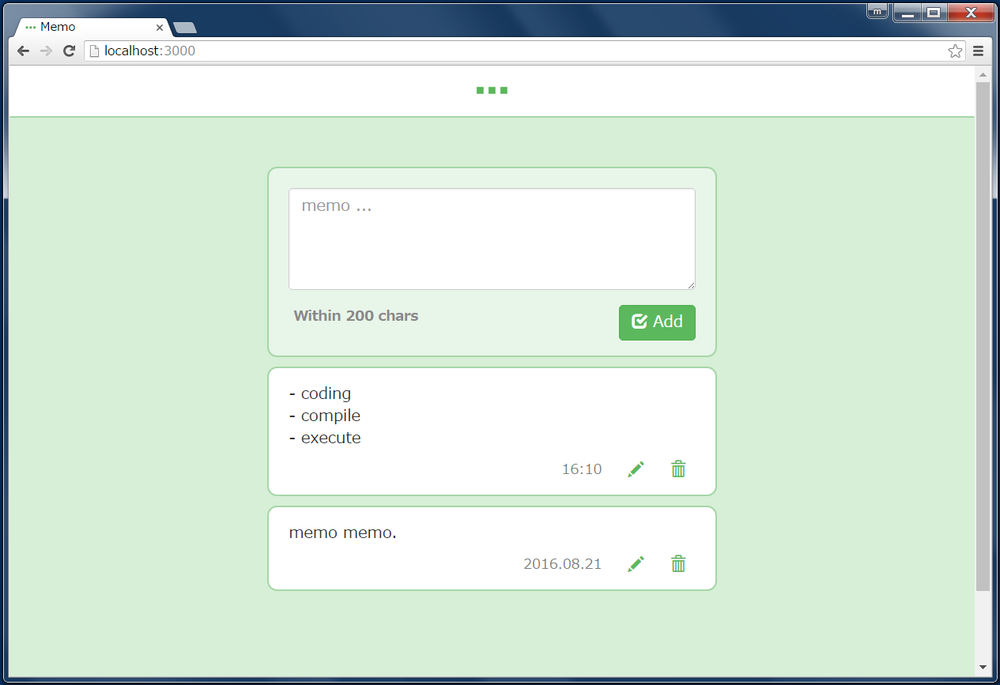

# Kaze Sample RDB

## Overview
This is a sample application using Kaze framework. This app has a user interface, in which user can post a simple memo. 




A Posted memo is stored in relational database.


## Dependencies
This app uses following products to access a dabase.

- [HikariCP](https://github.com/brettwooldridge/HikariCP)
- [sql2o](https://github.com/aaberg/sql2o)

And depends on [Flyway](https://github.com/flyway/flyway) for database migration. Other dependencies are written in [build.gradle](build.gradle) .


## Database Information
This app is configured to access PostgreSQL. All configuration such as database name, user name, password, etc is in [hikari.properties](src/main/resources/db/hikari.properties).


## Requirements
JDK 8+, PostgreSQL, Gradle, are needed.


## Starting App
After starting database, please execute commands bellow.

```
> git clone https://github.com/mamorum/kaze-sample.git
> cd kaze-sample
> cd rdb
> gradle run
```

Then, `http://localhost:8080/` returns a page.
