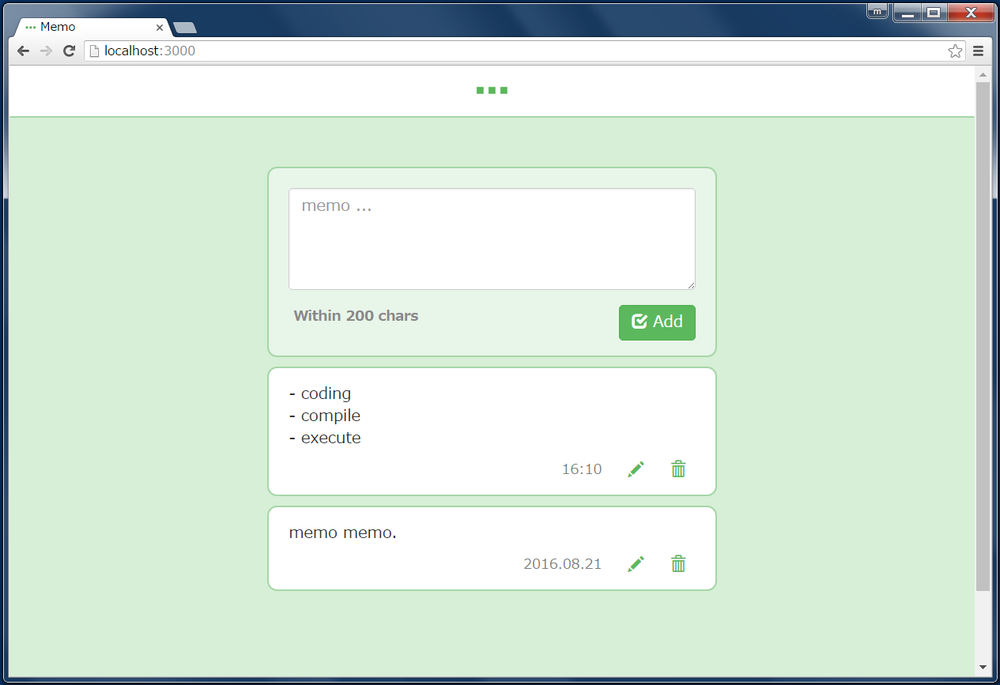

# Kaze Sample RDB
This is a sample application using Kaze framework. 

In this app, we can post a simple memo stored in the RDBMS.




## DB Access
### Products
- [HikariCP](https://github.com/brettwooldridge/HikariCP)
- [sql2o](https://github.com/aaberg/sql2o)
- [Flyway](https://github.com/flyway/flyway)


### Configs
Written in the [hikari.properties](src/main/resources/db/hikari.properties).


## Build System
- Maven
- [POML](https://github.com/mamorum/poml)

POML generates `pom.xml` from `pom.poml`.


## Starting App
### Requirements
- JDK 8+
- PostgreSQL
- Maven


### Step1. Start DB
Start PostgreSQL.

### Step2. Clone App
```
> git clone https://github.com/mamorum/kaze-sample.git
```

### Step3. Run App
```
> cd kaze-sample
> cd rdb
> mvn compile
> mvn exec:java
```

### Step4. Checking
Open `http://localhost:8080/`.
